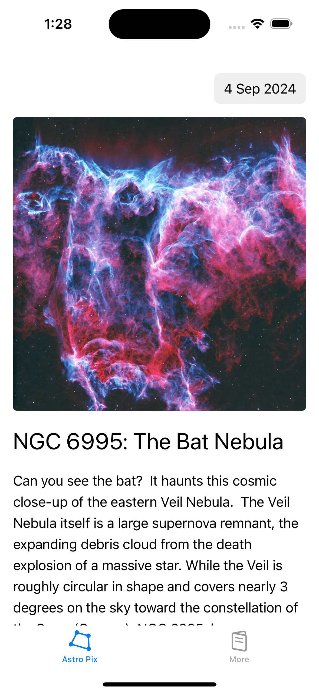
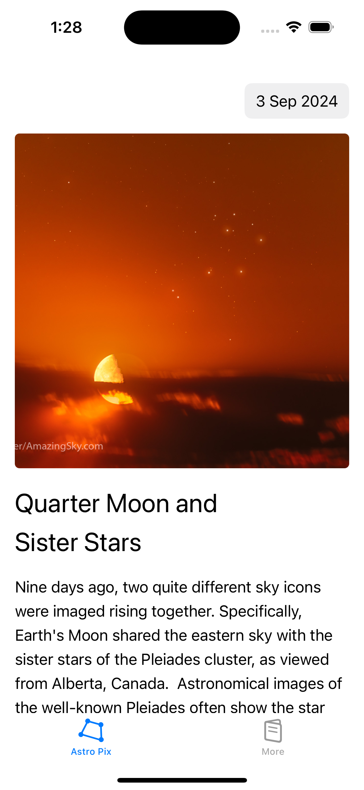
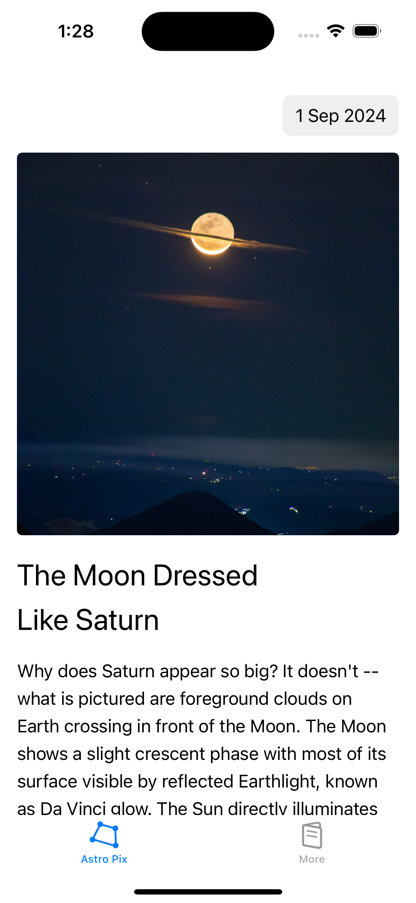

# CosmicView

CosmicView is an iOS application that allows users to view NASA's Astronomy Picture of the Day (APOD). 
This app demonstrates the use of modern Swift and iOS development practices, including asynchronous networking, caching, and clean architecture principles.

## Getting Started

* Please reference [nasa/apod-api](https://github.com/nasa/apod-api) for api-usage
* Launch App, put your API KEY in setting view
 
## Screenshots




```
MyProject/
│
├── README.md
├── Readme-Assets/
│   ├── APOD1.png
│   ├── APOD2.png
│   └── APOD3.png

```

## Features

* View Astronomy Picture of the Day: Displays the image or video featured on NASA's APOD with detailed descriptions.
* Date Picker: Users can select a specific date to view the APOD for that day.
* Image Caching: Images are cached for improved performance and offline access.
* Async/Await Networking: Modern async/await patterns are used for networking operations.
* Dark Mode Support: The app supports dark mode for a seamless user experience.
* Dynamic Type Accessibility: The app supports dynamic type text support for a seamless user experience.

## API Reference

#### Get picture of the day

```http
  GET https://api.nasa.gov/planetary/apod?api_key={API_KEY}&date={DATE}
```

| Parameter | Type     | Description                |
| :-------- | :------- | :------------------------- |
| `api_key` | `string` | **Required**. Your API key |
| `date`    | `string` | **Required**. Date (Ex: 2022-08-01) on which you want to view the Picture of the day |


## Tech Stack

**Client:** Swift 5, iOS 16.0 onwards

## Installation
Clone the repository:

```
git clone https://github.com/SivaGolla/CosmicView.git
Navigate to the project directory:
```

```
cd CosmicView
Open the project in Xcode:
```

```
open CosmicView.xcodeproj
Install dependencies:
```

Make sure you have the necessary dependencies installed.

```
swift package resolve
Build and run the project:
```

Select your target device or simulator in Xcode, and hit Cmd + R to build and run the project.

## Documentation

##### Environment
Each target is bound to work according to environment based on target name
Added an enum for populating end points according to target

##### ImageStore
It stores downloaded prictures into NSCache using its urlpath as a key to the cache

##### MediaRenderingView
A custom view which is capable of 
- rendering image view
- youtube url (uses a third party YouTubeiOSPlayerHelper library for YT playback support)
- web video url (uses WebKit to play web videos)

##### NetworkManager
Executes a given urlRequest using a NSUrlSession. Generaic method to fetch data of any type which is codable
